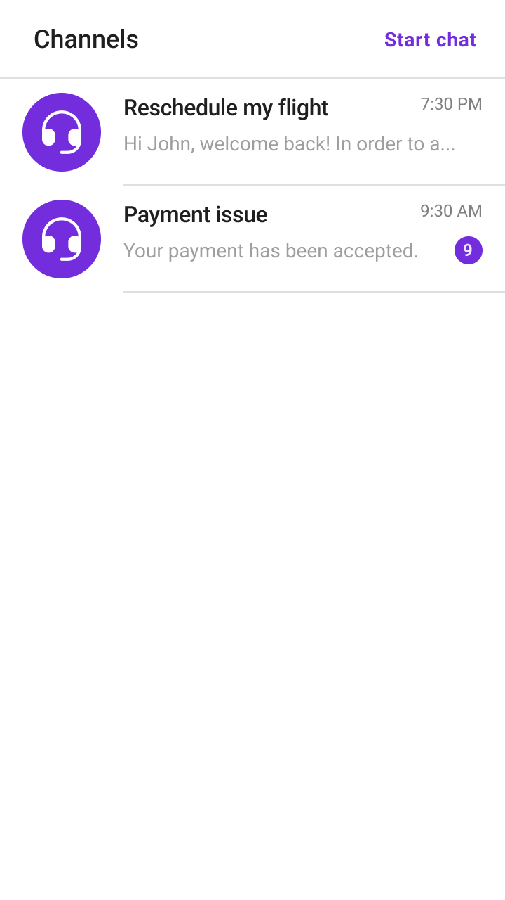
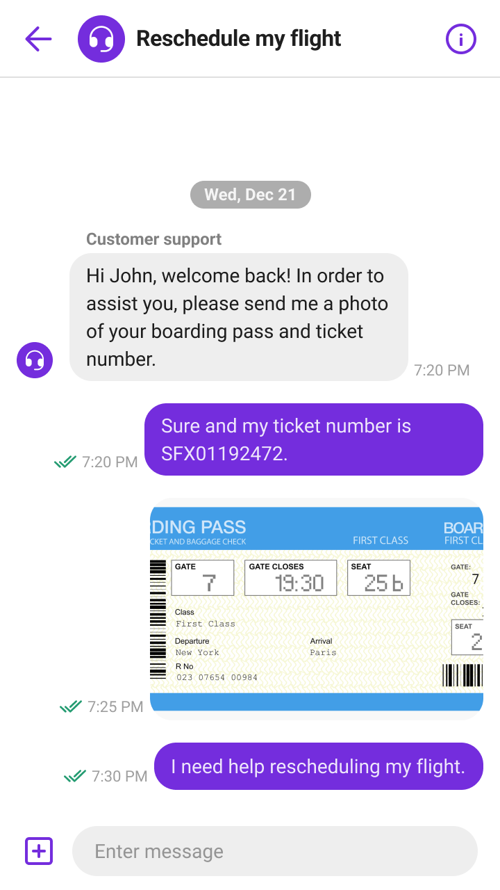
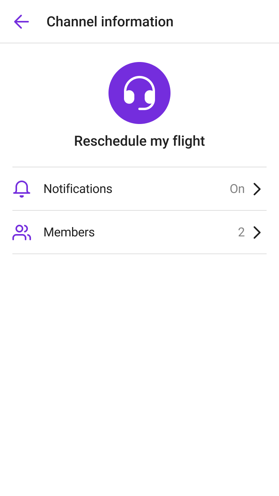

# Sendbird Support Chat Sample for iOS
This is an example of [Sendbird Support Chat](https://sendbird.com/docs/support-chat/v1/overview) for iOS, implemented using [Sendbird UIKit](https://sendbird.com/docs/uikit/v3/ios/overview).
<p>
Sendbird Support Chat: Salesforce Connector is a Sendbird Chat integration into your existing Salesforce Service Cloud that offers support focused chat experience with vast new features for agent productivity. With this Support Chat Salesforce sample app, you can quick start your client-side implementation.
</p>

<p align="center">
  
  
  
</p>


## Getting Started
1. Create your Sendbird application on [the dashboard](https://dashboard.sendbird.com/auth/signup).
2. [Install the Salesforce Connector package](https://sendbird.com/docs/support-chat/v1/salesforce-connector/integrate-with-salesforce-service-cloud) in your Salesforce organization. Please complete the necessary configuration by following the documentation.
3. In this example, we're connecting to a test purpose Sendbird application and a Salesforce organization. To connect yours, replace `applicationId` and others in the `AppDelegate.swift` file as follows:

```swift
@main
class AppDelegate: UIResponder, UIApplicationDelegate {

    var window: UIWindow?

    func application(_ application: UIApplication, didFinishLaunchingWithOptions launchOptions: [UIApplication.LaunchOptionsKey: Any]?) -> Bool {
        // Override point for customization after application launch.
        
        // TODO: App ID
        SendbirdUI.initialize(applicationId: "13B6D179-33A5-4C0D-9162-E11DAC9358FC") { error in
            //
        }
        
        SBUGlobals.currentUser = SBUUser(userId: "j_sung_0o0")
        
        // ...
    }
    
    // ...
}
```
4. Build & Run

## How to connect a channel to a case
In this example, we built a simple serverless endpoint on the Salesforce side to create a case. You can use the most popular way, the [Salesforce Rest API](https://developer.salesforce.com/docs/atlas.en-us.api_rest.meta/api_rest/intro_rest.htm), or refer to [our documentation](https://sendbird.com/docs/support-chat/v1/salesforce-connector/integrate-with-salesforce-service-cloud#2-step-5-client-side-implementation-3-create-a-case-through-apex-rest-api) to create a simple endpoint. To connect a channel to a case, you can do the following:

1. Create a channel with custom type: `SALESFORCE_SUPPORT_CHAT_CHANNEL`

```swift
/// Or override `SBUCreateChannelViewModel/createChannel`
SBUGlobalCustomParams.groupChannelParamsCreateBuilder = { params in
    params?.customType = "SALESFORCE_SUPPORT_CHAT_CHANNEL"
    params?.name = channelNames.randomElement()
}

/// Did tap "Start Chat" button
override func baseChannelListModule(_ headerComponent: SBUBaseChannelListModule.Header, didTapRightItem rightItem: UIBarButtonItem) {
    let params = GroupChannelCreateParams()
    params.name = ""
    params.coverURL = ""
    params.isDistinct = false
    params.isSuper = false
    params.isBroadcast = false

    SBUGlobalCustomParams.groupChannelParamsCreateBuilder?(params)

    GroupChannel.createChannel(params: params) { [weak self] channel, error in
        guard let self, let groupChannel = channel else { return }
        SBULoading.start()
        Task {
            // Create case
            try await self.updateToSupportChatChannel(groupChannel)
            DispatchQueue.main.async {
                SBULoading.stop()
                SendbirdUI.moveToChannel(
                    channelURL: groupChannel.channelURL,
                    messageListParams: nil
                )
            }
        }
    }
}
```

2. Create a case with fields from Salesforce Connector.


```swift
struct CreateSupportChatRequest: Encodable {
    let subject: String
    let suppliedName: String
    let sendbirdUserId: String
    let sendbirdChannelURL: String
    let isEinsteinBotCase: Bool

    var urlRequest: URLRequest {
        var request = URLRequest(url: URL(string: "https://sendbird11-dev-ed.develop.my.salesforce-sites.com/services/apexrest/cases/")!)
        request.httpMethod = "POST"
        request.addValue("application/json", forHTTPHeaderField: "Content-Type")
        request.httpBody = try? JSONEncoder().encode(self)
        return request
    }
}

func updateToSupportChatChannel(_ channel: GroupChannel) async throws {
    guard let currentUser = SBUGlobals.currentUser else { return }

    let isEinsteinBotCase = channel.members.contains { $0.userId == "einstein-bot" }
    let request = CreateSupportChatRequest(
        subject: channel.name,
        suppliedName:  currentUser.refinedNickname(),
        sendbirdUserId: currentUser.userId,
        sendbirdChannelURL: channel.channelURL,
        isEinsteinBotCase: isEinsteinBotCase
    )
        .urlRequest

    let (_, response) = try await URLSession.shared.data(for: request)
    guard let httpResponse = response as? HTTPURLResponse,
          httpResponse.statusCode == 200 else {
        throw SupportChatError.failedToCreateSupportChat
    }
    return
}
```

For more information, see [our documentation](https://sendbird.com/docs/support-chat/v1/salesforce-connector/integrate-with-salesforce-service-cloud#2-step-5-client-side-implementation).
